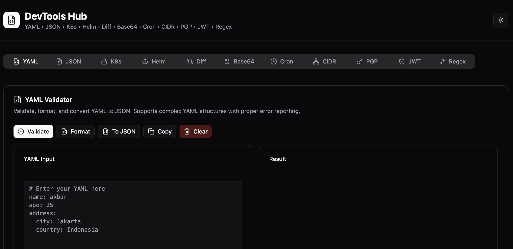

# DevTools Hub

> Free, fast, **100% client-side** developer utilities. No server, no tracking, no telemetry — your sensitive data (PGP keys, JWT secrets, K8s manifests, env vars) never leaves your browser.

<p align="center">
  <a href="https://devtool-gamma.vercel.app/">
    <strong>🌐 Live demo →&nbsp;&nbsp;devtool-gamma.vercel.app</strong>
  </a>
</p>

---

## Why this exists

Pasting your JWT secret, PGP private key, or Kubernetes secret manifest into a random online decoder is a terrible idea — you have no idea where it's logged. DevTools Hub gives you the same convenience, **locally in your browser**, with the full source open for audit.

Verify it yourself: open browser DevTools → Network tab → use any tool → see zero outbound requests.

---

## What's inside

11 tools covering daily DevOps and backend dev workflows:

| Tool | What it does |
|------|--------------|
| **YAML Validator** | Validate, format, and convert YAML ↔ JSON with clear error reporting |
| **JSON Validator** | Validate, format, and convert JSON ↔ YAML |
| **K8s Secret / ConfigMap** | Decode every `data:` Base64 in a manifest at once, or encode `key=value` pairs into a ready-to-apply manifest. Handles `stringData`, multi-doc YAML, and binary values |
| **Helm Chart Generator** | Form-based scaffolder — fill in image, replicas, port, env vars, service type, ingress config → download a complete Helm chart ZIP (`Chart.yaml` + `values.yaml` + `templates/*.yaml`), ready to `helm install` |
| **Diff Tool** | Compare two texts by line, word, or character |
| **Base64** | UTF-8 safe encode/decode with URL-safe option |
| **Cron Helper** | Parse cron expressions, validate, and show the next 8 executions. Supports `@daily` / `@hourly` shortcuts, named months/weekdays, POSIX OR semantics |
| **CIDR Calculator** | IPv4 network calculator: network/broadcast, masks, host counts, binary/hex, RFC 1918 + CGNAT + link-local detection, plus subnet split |
| **PGP Toolkit** | 4-in-1: **Generate** keypairs (Curve25519 / RSA 2048 / RSA 4096), **Encrypt** messages with a recipient's public key, **Decrypt** with your private key + passphrase, **Inspect** any key (fingerprint, user IDs, algorithm, expiry, subkeys) |
| **JWT Decoder** | Inspect JWT structure with color-coded sections (header / payload / signature), validate `exp` and `nbf`, annotate known claims, warn on `alg: none` |
| **Regex Tester** | Live regex tester with 6 flag toggles, 6 preset patterns (email, URL, IPv4, hex, UUID, ISO date), highlighted preview, and capture group details |

---

## Privacy

Everything runs in your browser. No backend, no API calls to third-party services, no analytics, no cookies.

The few heavy libraries (`openpgp` ~700KB, `jszip` ~100KB) are **lazy-loaded on demand** when you use the relevant tool, keeping the initial bundle small.

---

## Tech stack

- **React 19** + **TypeScript 5** + **Vite 7**
- **Tailwind CSS** + **shadcn/ui** (built on Radix UI primitives)
- **lucide-react** — icons
- **sonner** — toast notifications
- **js-yaml** — YAML parsing / serialization
- **openpgp** (lazy-loaded) — PGP operations
- **jszip** (lazy-loaded) — Helm chart ZIP packaging

---

## Project structure

```
src/
├── App.tsx                    # tab orchestrator, header, footer
├── components/
│   ├── ui/                    # shadcn/ui primitives (Card, Button, etc.)
│   └── ThemeToggle.tsx        # light/dark mode toggle
└── tools/                     # one .tsx file per tool tab
    ├── YamlValidator.tsx
    ├── JsonValidator.tsx
    ├── K8sSecretTool.tsx
    ├── HelmChartTool.tsx
    ├── DiffTool.tsx
    ├── Base64Tool.tsx
    ├── CronTool.tsx
    ├── CidrTool.tsx
    ├── PgpTool.tsx            # mode-switching shell
    ├── pgp/                   # PGP sub-modes
    │   ├── PgpGenerate.tsx
    │   ├── PgpEncrypt.tsx
    │   ├── PgpDecrypt.tsx
    │   └── PgpInspect.tsx
    ├── JwtTool.tsx
    └── RegexTool.tsx
```

Each tool is **self-contained** — drop a new `.tsx` file into `tools/`, register it in `App.tsx` with one `TabsTrigger` + one `TabsContent`, and you're done.

---

## Getting started

```bash
# Clone
git clone https://github.com/imammaulanaa/devtool.git
cd devtool

# Install dependencies
npm install

# Dev server
npm run dev
```

Production build:

```bash
npm run build
npm run preview
```

---

## Key features

- ✅ **100% client-side** — no data ever leaves your browser
- ✅ **Modular architecture** — each tool in its own file, easy to add/remove
- ✅ **Lazy-loaded heavy deps** — small initial bundle, fast first paint
- ✅ **Dark mode** — auto-detect OS preference, manual toggle, persisted
- ✅ **Responsive** — works on mobile, tablet, desktop
- ✅ **Accessible** — built on Radix UI primitives (keyboard nav, ARIA, focus management)
- ✅ **Type-safe** — full TypeScript coverage

---

## Contributing

Contributions welcome — open an issue or PR. Some ideas for future tools:

- TLS certificate decoder (paste PEM → see subject, SAN, issuer, validity)
- JSONPath / JMESPath tester
- Curl builder / parser
- HPA / PVC / RBAC scaffolding in the Helm tool
- Kustomize previewer
- Markdown ↔ HTML converter
- Color converter (hex / rgb / hsl / oklch)

---

## License

MIT — see [LICENSE](LICENSE) for details.

---

## Author

Built with ❤️ by [@imammaulanaa](https://github.com/imammaulanaa)
